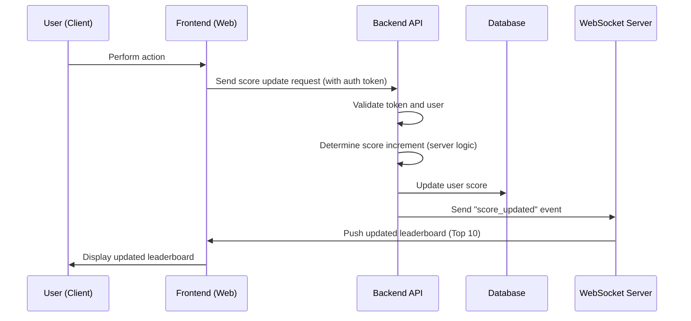

# ScoreBoard API Module

## 1. Introduction

The **ScoreBoard API** module provides APIs for managing user leaderboards.

Main objectives:

-   Display the **Top 10 players with the highest scores** in real time.
    
-   Allow users to **increase their score when completing an action** (the specific action does not matter).
    
-   Prevent **fraudulent score increases** from users.
    

----------

## 2. Main Components

1.  **ScoreBoard Service**
    
    -   Stores and queries the leaderboard.
        
    -   Provides an API to retrieve the Top 10 scores.
        
    -   Updates scores upon receiving valid requests.
        
2.  **Score Update API**
    
    -   Receives requests from the frontend when a user completes an action.
        
    -   Validates access rights (JWT or session token).
        
    -   Only allows score increases **based on server-side logic** (the client cannot send scores directly or cheat).
        
3.  **Realtime Update (WebSocket)**
    
    -   Pushes updated leaderboard data to all connected clients.
        
    -   Ensures real-time synchronization.
        

----------

## 3. Execution Flow



----------

## 4. API Specification

### 4.1. Increase Score

`POST /scoreboards/v1/score/increase`

**Headers**

-   `Authorization: Bearer <JWT>`
    

**Request Body**

```json
{
  "action_id": "completed_task"
}

```

> ⚠️ **Note**: The client **must not send the score value**. The backend will calculate the score based on `action_id` or internal logic.

**Response**

```json
{
  "success": true,
  "data": {
    "user_id": "user_123",
    "new_score": 2000
  }
}

```

----------

### 4.2. Get Leaderboard

`GET /scoreboards/v1/scoreboards/top`

**Response**

```json
{
  "scoreboard": [
    { "user_id": "user_123", "username": "Alice", "score": 2000 },
    { "user_id": "user_456", "username": "Bob", "score": 2400 }
  ]
}

```

----------

### 4.3. Listen for Realtime Updates

`WebSocket /ws/scoreboard`

**Event:**

```json
{
  "event_socket": "score_updated",
  "payload": [
    { "user_id": "user_123", "username": "Alice", "score": 2000 },
    { "user_id": "user_456", "username": "Bob", "score": 2400 }
  ]
}

```

----------

## 5. Security & Anti-Cheating

1.  **Authentication**
    
    -   All APIs require a valid, non-expired JWT/Access token.
        
    -   The token is tied to a user ID and cannot be forged.
        
2.  **Server-side score calculation**
    
    -   The client only reports "action completed".
        
    -   The server maps the action → corresponding score.
        
    -   Prevents users from sending custom score values.
        
3.  **Rate limiting / Throttling**
    
    -   Limit the number of score update requests within a specific time window.
        
    -   Prevents bots from spamming requests.
        
4.  **Logging & Audit**
    
    -   Keep a history of score updates for fraud investigation if necessary.
        

----------

## 6. Notes & Additional Comments

-   **Performance**: If the user base is very large, consider indexing the **score** column to optimize query performance.
    
-   **Extensibility**: Add an API `GET /scoreboards/v1/scoreboard/me` so users can view their own rank.
    
-   **Realtime**: WebSocket is the recommended approach for live updates.
    

----------
